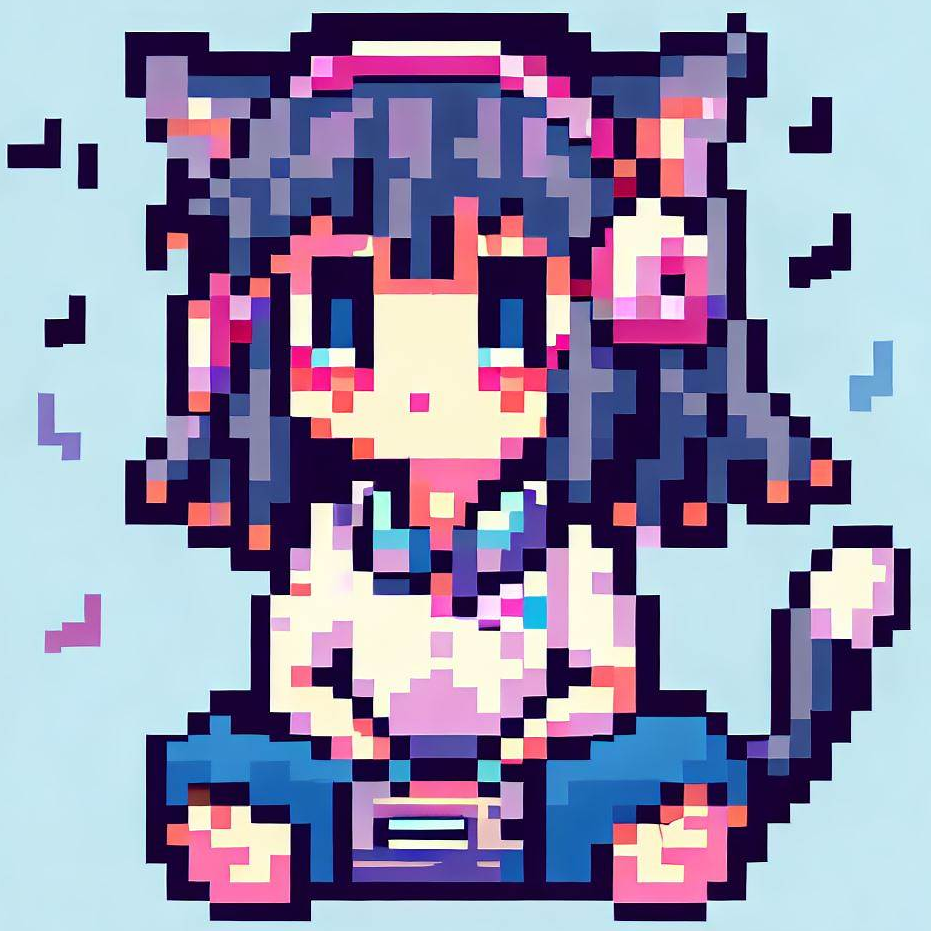

这是color_yr的 [AllMusic_Client](https://github.com/Coloryr/AllMusic_Client) 的一个fork

仅作为 [NekoMusic_Server](https://github.com/lolicode-org/NekoMusic_Server) 的配套客户端使用，不保证不破坏原有功能，不保证与上游的兼容性

下载：[Release](https://github.com/KoishiMoe/NekoMusic_Cli/releases)

----------------------------------

已知问题：
* 启动后首次进入时图片可能会炸掉，退出重进就好了
* 图片加载失败后会连带着信息hud一起消失掉
* 有时播放的音乐或者显示的封面会是之前的歌的
* 以上问题主要发生在快速切歌时，使用时不频繁切歌能减少问题发生的概率。个人建议关掉封面显示（在模组设置里能找到）

为啥有Bug不修？

一没注释二没javadoc三没提交记录，拿头修……

总而言之这项目的源码我看着头晕，做的修改也都是打补丁，现在这些问题我也不知道是原来就有只是原作者没发现或者不想修，还是我乱改改出来的……反正勉强能用，先凑合……吧？

以后有时间的话会考虑从头重做一个，大概

